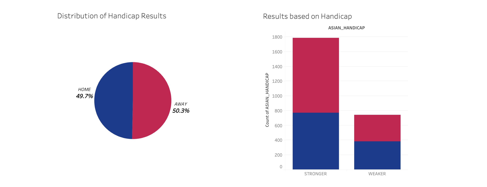
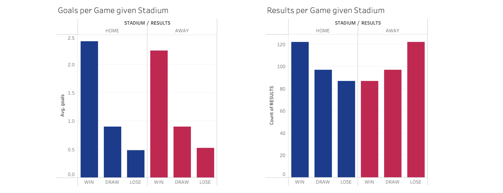
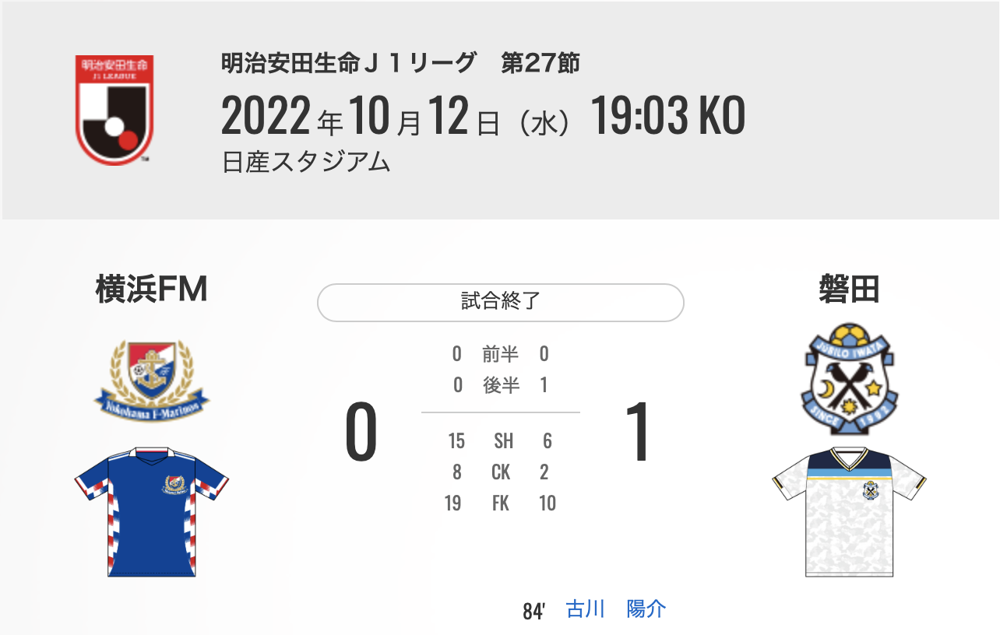

<div align="center">
  <h1>
    Wager Optimisation
  </h1>
  <h3>
    <i>Predicting J-League Asian Handicap with Machine Learning</i>
  </h3>
  <a href="https://bet.hkjc.com/football/index.aspx?lang=en">
    
  </a>
  <p>
    <i>Credit: <a href="https://www.donotgamble.org.hk/en/index.php">The Ping Wo Fund</a></i>
  </p>
</div>

---
### TL;DR
We used a random forest model (tuned with BayesSearchCV) to predict Asian handicap results in the J-League. The model achieved 64% accuracy and is expected to generate at least HKD 1,560 in 73 football matches.

<p align="center">
  <b>DISCLAIMER: THIS PROJECT DOES NOT ENCOURAGE ANY WAGERING BEHAVIOUR</b>
</p>

---
### Repository Structure
```
J-League-Prediction-YATTA
|
└───data
|   |   fixtures.parquet            # normalised fixture records
|   |   j1_league_featured.parquet  # featured data
|   |   j1_league.parquet           # raw data
|   |   plays.parquet               # normalised play records
|
└───eda
|   |   eda.twbx  # Tableau workbook to verify opportunities
|
└───imgs
|   |   <images used on README.md>
|
└───src
|   |   01_web_scraping.ipynb         # ingest J1 league data from the Internet
|   |   02_data_preprocessing.ipynb   # cleanse and wrangle raw data
|   |   03_feature_engineering.ipynb  # create and explore explanatory variables
|   |   04_machine_learning.ipynb     # build and tune learning algorithms
|   |   05_model_evaluation.ipynb     # calculate profit and ROI
|
└───README.md  # you are here
|
└───requirements.txt  # dependencies used on the project
```

---
### Background
"_Small bets for entertainment, big bets to become like Li Ka-Shing._" Wagering on a football match can be incredibly exciting. The outcome is never certain until the final second, and the hope and trust placed in your bet heighten the thrill throughout the two hours. Despite our years of experience, we have not developed any specific strategies for each wager, instead relying on intuition and conviction. With the 2022 FIFA World Cup approaching, the topic heated up and sparked our motivation to build machine learning models for predicting the outcomes of football matches. We found the idea of applying our expertise to this field interesting, so we kicked off the project in late October 2022.

---
### Data Source
As the slogan suggests, this project focuses on the J-League, specifically, the J1 League for the 2022 season. Since the J-League is not as popular as other major football leagues, many data-providing websites lack complete records. Although the [official website](https://www.jleague.jp/match) and the [Jockey Club](https://footylogic.com/en/tournament/league/50000009/standings) release match results, programming a web scraper takes time. Fortunately, we discovered that [TotalCorner](https://www.totalcorner.com) shares structured datasets for a variety of leagues in a user-friendly web design. We properly cleansed and wrangled the data for our experiments, and translated our wagering experience into additional features aimed at improving model fit.

Here we place some assumptions about the data:

- Data available on TotalCorner are valid and sound
- Individual records are independent of each other (a fundamental assumption of learning algorithms)

---
### Exploratory Data Analysis
With years of experience, we dare to say that wagering on [Asian handicap](https://is.hkjc.com/football/info/en/betting/bettypes_hdc.asp) (the handicap) is both the simplest and the harshest option for generating profits. This project aims to estimate the handicap results and optimise return on investment (ROI).

<p align="center">
  <a href="https://bet.hkjc.com/football/index.aspx?lang=en">
    
  </a>
</p>

To account for dealer manipulation, the match results are adjusted after the addition of the handicap. The handicap reflects the market attitude towards the games. Usually, it would balance the final match results for the two playing teams. A half-half outcome is expected, as shown in the left-hand-side figure. Moreover, teams playing at their home stadium typically feel more confident and often outperform the opposing team. Thus, we can use this factor as a proxy for dealer thinking when players are on their home field. The figure on the right-hand side supports these ideas.

<p align="center">
  <a href="https://bet.hkjc.com/football/index.aspx?lang=en">
    
  </a>
</p>

Considering the insights from the above figures, can we say that the home stadium effect is significant? We conducted several hypothesis tests to examine this belief. Unfortunately, while there is a difference in the stadium effect, it is not statistically significant (less than 5% in our test). However, we are not solely interested in the raw data source. We calculated several net differences as input features, which improved the performance of the learning algorithm.

---
### Model Building and Evaluation
To simulate the actual performance of model prediction, we split the data into two portions, where matches after September are considered production data and will be used to calculate ROI. We built six models for this project, including a distance-based model, linear models, ensemble tree models, and a neural network model. To optimise performance, we also tuned the algorithms with several methodologies, such as `RandomisedSearchCV`, `BayesSearchCV`, `Optuna`, and `Hyperopt`. Since the handicap (response variable) is almost balanced by nature under dealer manipulation, the objective of hyperparameter tuning is to maximise accuracy.

| Model | ACCURACY | AUC | PARAMETERS |
| --- | --- | --- | --- |
| Random Forest (BayesSearchCV) | 0.643836 | 0.627112 | OrderedDict([('bootstrap', False), ('criterion... |
| Random Forest (Optuna) | 0.630137 | 0.610983 | {'bootstrap': False, 'criterion': 'entropy', '... |
| Random Forest | 0.616438 | 0.603303 | None |
| eXtreme Gradient Boosting (Optuna) | 0.616438 | 0.599078 | {'colsample_bytree': 0.38691249885012907, 'eva... |
| eXtreme Gradient Boosting (Hyperopt) | 0.616438 | 0.569508 | {'colsample_bytree': 0.34187263717236394, 'eva... |

As shown above, ensemble tree models outperform production data while achieving at least 60% accuracy, which beats random guesses. After training the models, 73 games remain for wagering. The Random Forest with BayesSearchCV (the model) generates at least HKD 1,560 (minimum HKD 200 per bet), resulting in a 29% ROI. Within two months (until the end of the season), the model yielded a positive return, as evidenced by the production data. However, we cannot conclude the project's success and will explain why in the next section.

---
### Defect and Brainstorm
Upset matches are not uncommon in any league. No one knows when a game will be an upset, including dealers, and sometimes the outcome does not make much sense. For [example](https://www.jleague.jp/match/j1/2022/101203/live/#teamdata), there was a match between Yokohama F-Marinos (first in ranking) and Jubilo Iwata (last in ranking). Dealers believed Yokohama F-Marinos would win the game and assigned a negative handicap to the team. However, Jubilo Iwata ended up defeating Yokohama F-Marinos.

<div align="center">
  <a href="https://bet.hkjc.com/football/index.aspx?lang=en">
    
  </a>
  <br>
  <i>Credit: <a href="https://www.jleague.jp/match/j1/2022/101203/live/#teamdata">jleague.jp</a></i>
</div>

<pre>
<b>Model Prediction:
index    date          home                  away            handicap    results    net_goals    y_hat</b>
2432     2022-10-12    Yokohama F-Marinos    Jubilo Iwata    -2.0        0          -1           1
</pre>

Our model also predicted that Yokohama F-Marinos would win the game, as shown in y_hat. Given that these unexpected events occur sometimes, there is no foolproof method for predicting outcomes. In other words, it is extremely challenging, if not impossible, for learning algorithms to generalise this kind of pattern, which is also a limitation of the project.

We found this problem occurs every season, and we have failed to train any model on a large scale. We consider the situation as data drifting over time. Under error analysis, even our experts struggle to make sense of the predictions. We rely on wagering strategies and try to bet on different combinations to generate profit. The model we built for this project failed to be viable for long-term production, which is why we do not consider it a project success.

After hundreds of experimental loops, we achieved around 80% accuracy IF WE CAN PREDICT THE MATCH RESULTS CORRECTLY. It seems infeasible and unrealistic to achieve 100% accuracy in predicting game results, but we may obtain a 60% to 80% accuracy model on the handicap if we could do well in predicting game outcomes with at least a 70% score on metrics.

---
### Acknowledgements
- Discussion on sports event prediction: "[Low classification accuracy, what to do next?](https://stats.stackexchange.com/questions/38218/low-classification-accuracy-what-to-do-next)"
- Ideas for tuning hyperparameters were referenced from "[Hyperparameter Optimization of Machine Learning Algorithms](https://github.com/LiYangHart/Hyperparameter-Optimization-of-Machine-Learning-Algorithms)"

---
### License
This project is licensed under the MIT License. See the [LICENSE](./LICENSE) file for details.
