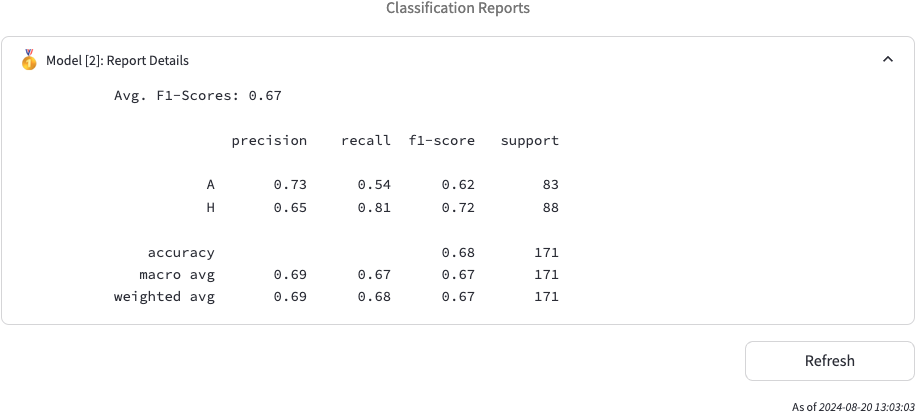
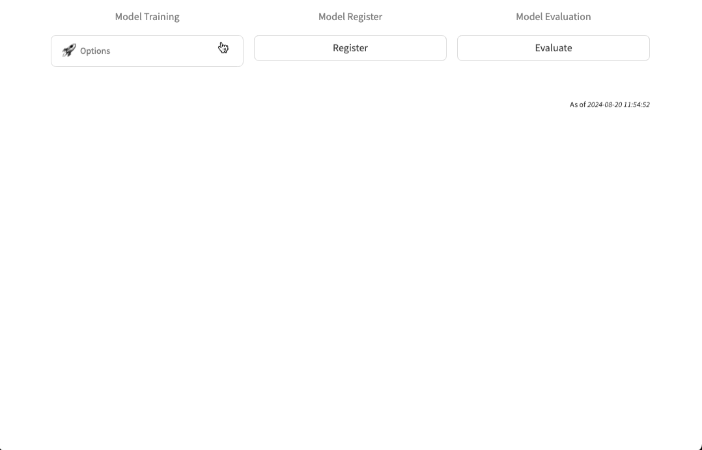
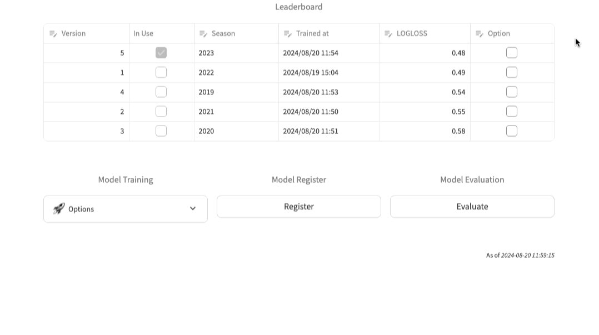
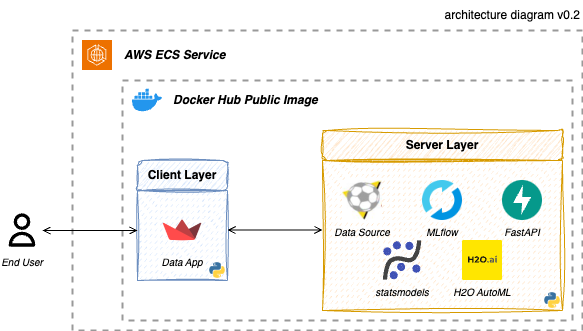
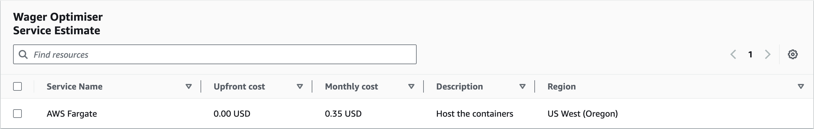

<!-- TITLE -->
# ⚽️ Wager Optimiser


<!-- BACKBROUND -->
<div align="center">
  <div class="headline">
    <a href="https://bet.hkjc.com/football/index.aspx?lang=en">
      
    </a>
  </div>
  <div class="badge">
    <a href="https://demo-wager-optimiser.streamlit.app/"></a>
    <a href="https://hub.docker.com/r/jackcky/wager-optimiser-backend"></a>
  </div>
</div>

<br>Living by the philosophy, "_Small bets for entertainment, big bets to become like Li Ka-Shing_," sports wagering offers an adrenaline-filled experience. The hook lies in the unpredictable outcome, which keeps the excitement high throughout the match.

Over the decades, we have donated an enormous amount of money to the Hong Kong Jockey Club (HKJC) because of losing bets. Our betting was based on intuition and conviction rather than rigid strategies. With the 2022 FIFA World Cup on the horizon, discussions around strategic betting escalated, leading to the idea of developing machine learning models to predict match outcomes.

<div align="right">
  <p>
    <i>Image Credit: <a href="https://www.donotgamble.org.hk/en/index.php">Ping Wo Fund</a></i>
  </p>
</div>

**First Published:** 26 November 2022  
**Last Updated:** 23 August 2024


<!-- ROADMAP -->
## Table of Contents
- [1 - Motivation](#1)
    - [1.1 - Does it really work?](#1.1)
- [2 - Who Are You Going to Bet On?](#2)
    - [2.1 - Predict the Next Winner](#2.1)
    - [2.2 - Hosting Your Wager Optimiser](#2.2)
- [3 - Solution Architecture](#3)
    - [3.1 - Regard Losing Less as Winning](#3.1)
    - [3.2 - Production Scenario](#3.2)


<!-- SECTION 1 -->
<a name="1"></a>

## Motivation: Optimise Return on Bets
In our experience, we have found that [Asian Handicap](https://is.hkjc.com/football/info/en/betting/bettypes_hdc.asp) is extremely intriguing, yet the harshest option. It levels the playing field between the home and away teams, making it a real challenge to predict the winning side. That being said, dealers usually offer more favourable odds.

Our goal is to make predictions on Asian Handicap, specifically on the [J1 League](https://www.jleague.co/). Wager Optimiser covers an end-to-end machine learning (ML) lifecycle from data gathering to ML model management. By leveraging the power of ML, gamblers worldwide (end users) can easily get betting hints toward the results and optimise return on bets (RoB).

<div align="center">
  <a href="https://bet.hkjc.com/football/index.aspx?lang=en">
    
  </a>
  <p>
    <i>Credit: itspusher@GIPHY</i>
  </p>
</div>

<a name="1.1"></a>

### Does it really work?
As of the time of writing, the optimiser has achieved an F1 score of 0.67 in handicap prediction for the 2024 season. Let's say you are betting with HKJC, the average odds are around 1.8. The optimiser recommended betting on 171 games, of which 116 were bingo. The minimum cost was HKD 34,200, and the expected return was HKD 41,760. This results in a RoB of 22.1%. Does it sound appealing?

<div align="center">
  <a href="https://demo-wager-optimiser.streamlit.app/">
    
  </a>
</div>

> [!CAUTION]  
> Any betting decisions made based on these recommendations are at users' own risk.


<!-- SECTION 2 -->
<a name="2"></a>

## Who Are You Going to Bet On?
If you are an addicted gambler, do you dare to bet on Asian Handicap with us? Are you brave enough to bet on a team without analysing any historical data, but putting your trust in the optimiser?

<a name="2.1"></a>

### Predict the Next Winner
Simply visit **Wager Optimiser** on [Streamlit Community Cloud](https://demo-wager-optimiser.streamlit.app/) and you can find the latest recommended bets.

> [!TIP]  
> Life is too short to regret not betting on Asian Handicap.

<details>
  <summary>Match Summary</summary>
  <div class="user_manual">
    Users can select teams for the upcoming match to review their recent performance and the match summary.
  </div>
  <div align="center">
    <a href="https://demo-wager-optimiser.streamlit.app/">
      
    </a>
  </div>
</details>

<details open>
  <summary>Handicap Prediction</summary>
  <div class="user_manual">
    Users can input additional match information to request a prediction for the selected match.
  </div>
  <div align="center">
    <a href="https://demo-wager-optimiser.streamlit.app/">
      
    </a>
  </div>
</details>

<details>
  <summary>Model Training</summary>
  <div class="user_manual">
    There are 2 options for model training: (1) training a seasonal model and (2) training a latest model. The seasonal model is trained on a full season of historical results, whereas the latest model is trained on all available records. Because the latest model has the potential to overfit the current season data, its evaluation function is disabled.
  </div>
  <div align="center">
    <a href="https://demo-wager-optimiser.streamlit.app/">
      
    </a>
  </div>
</details>

<details>
  <summary>Model Evaluation</summary>
  <div class="user_manual">
    Users can select up to 5 models to evaluate their performance on the current season. This helps users choose the most high-performing model for prediction.
  </div>
  <div align="center">
    <a href="https://demo-wager-optimiser.streamlit.app/">
      
    </a>
  </div>
</details>

<details>
  <summary>Model Register</summary>
  <div class="user_manual">
    Users can register a model to be used for predictions. This allows users to select a model they want to use for future predictions.
  </div>
  <div align="center">
    <a href="https://demo-wager-optimiser.streamlit.app/">
      
    </a>
  </div>
</details>

<a name="2.2"></a>

### Hosting Your Wager Optimiser
You can host a full version of Wager Optimiser in your preferred environment. The instructions below will guide you through the deployment process. Due to copyright issues, team logos are not bundled within the repository and the Docker image. You might need to source those images by yourself if you wish to fully reproduce the app.

> [!CAUTION]  
> Any betting decisions made based on these recommendations are at users' own risk.

<details>
  <summary>🐳 Docker Host</summary>
  <div class="local_docker">
    <p class="preface">
      The optimiser consists of two parts: a backend server and a frontend server. Docker Compose will help create these containers all at once. Before following the steps, make sure your computer has <a href="https://www.docker.com/">Docker</a> installed to host the optimiser.
    </p>
    
  1. Clone the repository and navigate inside the folder.
      ```sh
      $ git clone https://github.com/Jack-cky/Wager-Optimiser.git
      $ cd Wager-Optimiser/docker
      ```
  2. Host the optimiser.
      ```sh
      $ docker compose up -d
      ```
  </div>
</details>

<details>
  <summary>☁️ AWS ECS Host (Recommended)</summary>
  <div class="aws_ecs">
    <p class="preface">
      Because H2O has certain hardware <a href="https://docs.h2o.ai/h2o/latest-stable/h2o-docs/welcome.html">requirements</a>, it is recommended to deploy it on a cloud service. Before following the steps, make sure your computer has <a href="https://developer.hashicorp.com/terraform/tutorials/aws-get-started/install-cli">Terraform</a> installed to provision an ECS service on AWS.
    </p>
    
  1. Clone the repository and navigate inside the folder.
      ```sh
      $ git clone https://github.com/Jack-cky/Wager-Optimiser.git
      $ cd Wager-Optimiser/terraform
      ```
  2. Update AWS access keys inside `main.tf`
      ```
      access_key = "your_aws_access_key"
      secret_key = "your_aws_secret_key"
      ```
  3. Initialise a working directory.
      ```sh
      $ terraform init
      ```
  4. Create an execution plan for AWS environment.
      ```sh
      $ terraform plan
      ```
  5. Provision an ECS to host the optimiser.
      ```sh
      $ terraform apply -auto-approve
      ```
  </div>
</details>

Once your deployment is ready, simply visit `<ip_address>:8000` for the backend API service and `<ip_address>:8501` for the frontend platform.


<!-- SECTION 3 -->
<a name="3"></a>

## Solution Architecture
The architecture comprises two components: a frontend server and a backend server. Every week, **Football-Data** updates [leagues](https://www.football-data.co.uk/japan.php) match results and odds records in tabular data format.

The backend server downloads the data and processes it for statistics queries and match predictions. There are two ML models trained in the optimiser: (1) the _Goal Probability Matrix_ (GPM) and (2) the _Handicap Predictor_ (HCP). The GPM models are trained using the Poisson model API from **statsmodels**, while the HCP models are trained using **H2O AutoML**.

Since the optimiser handles two ML tasks with multiple models, we adopted **MLflow** to manage the ML experiments and keep track of their performance for each task. After cherry-picking the models, they are served as API endpoints with **FastAPI**.

The frontend server is a multi-serving platform built with **Streamlit**. It is used not only for match queries and predictions, but also for managing ML models on the same platform.

<div align="center">
  <a href="#3">
    
  </a>
</div>

<a name="3.1"></a>

### Regard Losing Less as Winning
As experienced gamblers, we can state with certainty that no single game outcome is guaranteed. An outstanding team can suddenly underperform when facing a seemingly weaker team (outliers). Likewise, a team's performance can vary dramatically from season to season (data drift). Handling these shifts manually can become burdensome. That's why predicting the handicap necessitates the use of MLOps to alleviate the [depressing task](https://github.com/LiYangHart/Hyperparameter-Optimization-of-Machine-Learning-Algorithms) of hyperparameter tuning and retraining models on a seasonal basis.

> Goal Probability Matrix forecasts the probabilities of correct [scores](https://special.hkjc.com/e-win/en-US/betting-info/football/correct-score/).

The GPM model assumes the number of goals follows a Poisson distribution and formulates the difference as a Skellam distribution. (Credit goes this [post](https://dashee87.github.io/football/python/predicting-football-results-with-statistical-modelling/) for the modelling idea). Theoretically, it models the correct score accurately when teams behave according to a Poisson distribution. We hope this _WRONG_ model could be _USEFUL_ enough to provide gamblers with a high-level insight into their past score distribution.

> Handicap Predictor predicts the results of Asian Handicap.

The HCP is a two step model with two steps: (1) predicting which side is winning and (2) deciding whether the game is a confident bet. The first layer learns from the net difference in team properties, such as seasonal rank and scores, while the second layer builds upon the predicted probabilities and the actual result. This design aims to prevent gamblers from betting on uncertain games.

<a name="3.2"></a>

### Production Scenario
Suppose you want to deploy the optimiser in an **AWS** environment. It will be deployed to an **ECS** to host both the frontend and the backend in a single service. As each team plays a game once a week, running the service for one hour per week is sufficient for prediction and ML model management. This will cost approximately _USD 0.35_ per month for operation, which can definitely be offset by the [RoB](#1.1). Detailed price calculations can be found on the [calculator](https://calculator.aws/#/estimate?id=02c7d634e7abe5fba42fb1ae25b2972810e85ec1).

<div align="center">
  <a href="https://calculator.aws/#/estimate?id=02c7d634e7abe5fba42fb1ae25b2972810e85ec1">
    
  </a>
</div>


<!-- MISCELLANEOUS -->
<a name="4"></a>

## Changelog
<details>
  <summary>[2.0.1] 2024-08-23</summary>
  <div class="detail">
    Revamped the project for model training process and served models as an API with a user interface.
    <h4>Added</h4>
    <ul>
      <li>Leveraged MLflow to track model experiments.</li>
      <li>Hosted the models' API with FastAPI at the backend server.</li>
      <li>Built a frontend interface using Streamlit to productionise the workflow.</li>
    </ul>
    <h4>Changed</h4>
    <ul>
      <li>Switched the data source from using TotalCorner to Football-Data.</li>
      <li>Used H2O AutoML to replace manual model tuning.</li>
    </ul>
  </div>
</details>

<details>
  <summary>[1.0.1] 2022-11-26</summary>
  <div class="detail">
    Initial publication.
  </div>
</details>


## Product Backlog
This project is managed with a product backlog. You can review the [backlog](https://docs.google.com/spreadsheets/d/1hZBngU6REh5M9iyUclPlf8IyO3Iz3ZVW1exo_-vM1ks/pubhtml?gid=278705126&single=true) to understand the prioritised list of features, changes, enhancements, and bug fixes planned for future development.


## License
This project is licensed under the MIT License. See the [LICENSE](./LICENSE) file for details. Feel free to fork and contribute to its further development!
