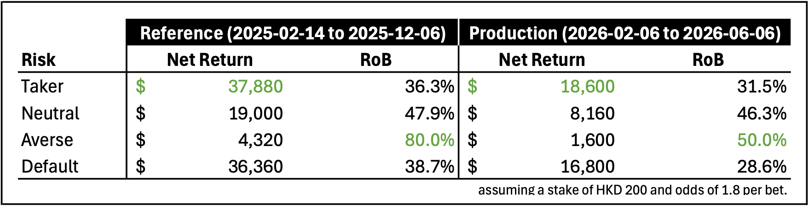
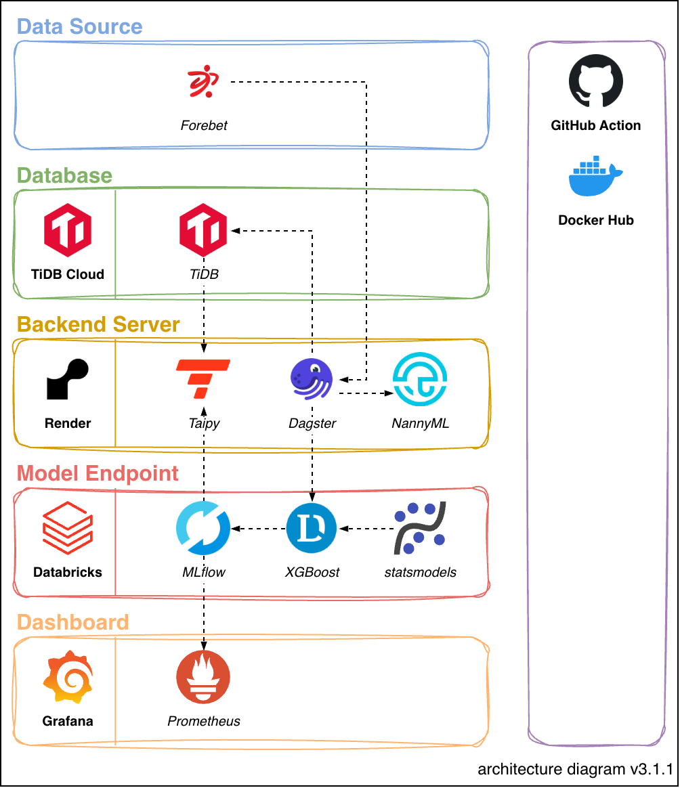

<!-- INTRODUCTION -->
# ⚽️ Bet Simulator
Living by the philosophy, "_Small bets for entertainment, big bets to become like Li Ka-Shing_," we see sports wagering as an adrenaline-filled experience. The hook is the uncertainty. You do not know the outcome, and that keeps the excitement high throughout the match.

Over the decades, we, as punters, have donated an enormous amount of money to the Hong Kong Jockey Club (HKJC) through losing bets. Most of those bets were driven by intuition and conviction rather than rigid strategies. In the run-up to the 2022 FIFA World Cup, the usual debate about "strategic betting" escalated, and that gave us the excuse to build an optimiser powered by machine learning.

  

  
  
  
  
<strong>First Published:</strong> 26 November 2022 <strong>Last Updated:</strong> 12 September 2026

<!-- ROADMAP -->
## Table of Contents
- [1 - Why We Built Bet Simulator](#1)
  - [1.1 - Does it really work?](#1.1)
- [2 - How Should I Use It?](#2)
  - [2.1 - Regard Losing Less as Winning](#2.1)
- [3 - Behind the Scenes](#3)

<!-- SECTION 1 -->

## Why We Built Bet Simulator
In our experience, [Asian Handicap](https://is.hkjc.com/football/info/en/betting/bettypes_hdc.asp) is both the most intriguing and the most punishing bet type. It levels the playing field between home and away teams, which makes it genuinely hard to pick a side while often offering more favourable odds.

Bet Simulator focuses on Asian Handicap in the [J1 League](https://www.jleague.co/). It covers an end-to-end Machine Learning Operations (MLOps), from data gathering to model lifecycle. The goal is simple: to provide betting hints and optimise return on bets (RoB).

  
  
<i>nothing makes us happier than being a philanthropist.</i>

### Does it really work?
The simulator has achieved an $F_{0.5}$ score of 0.71 for handicap prediction in the 2022 season. The mean winning rate for home teams is only 0.54, so the simulator performs far better than a naive strategy of simply backing the home side. Suppose you are betting with HKJC and the average odds are around 1.8. The simulator recommended bets on 305 games, of which 208 were correct. Assuming a stake of HKD 200 per bet, the winning bets would return HKD 74,880, resulting in a net profit of HKD 55,480. That works out to an RoB of 23%. Does it sound appealing?

  
  
<i>the ball is round, so you will never be able to beat the house.</i>

> [!CAUTION]  
> Any betting decisions made based on the simulator are at your own risk.

<!-- SECTION 2 -->

## How Should I Use It?
If you are an avid gambler, do you dare to bet on Asian Handicap with us? Are you brave enough to back a team without analysing the historical data yourself and instead put your trust in the simulator?

> [!NOTE]  
> Latency is expected for Bet Simulator relies on free-tier services, so a sleeping instance may need a moment to wake up before kick-off.

> [!TIP]  
> Life is too short to regret not betting on Asian Handicap.

### Regard Losing Less as Winning
As experienced gamblers, we can state with certainty that no single game outcome is guaranteed. An outstanding team can suddenly underperform against a seemingly weaker team, creating outliers. Likewise, a team's performance can vary dramatically from season to season, leading to data drift. Handling these shifts manually can become burdensome. That is why predicting handicap outcomes requires MLOps to ease the depressing task of hyperparameter tuning and retraining models each season.

> Expected Goals (xG) estimates each team's scoring rate for the upcoming fixture.

The xG features assume the number of [goals](https://dashee87.github.io/football/python/predicting-football-results-with-statistical-modelling/) follows a Poisson distribution, refitting a Poisson regression every matchday to estimate how many goals each side should score. We hope this _WRONG_ model is still _USEFUL_ enough to capture team strength alongside Elo ratings, rest days, and head-to-head records.

> Handicap Predictor (HCP) predicts Asian Handicap outcomes.

The HCP is an XGBoost classifier that learns from net differences in team properties, such as seasonal rank and scoring. Its predicted probability is then passed through risk-dependent thresholds, so a bet is only recommended when the model's confidence clears your chosen risk attitude. This design aims to discourage betting on uncertain matches.

  
  
<i>RoB varies with your risk attitudes.</i>

<!-- SECTION 3 -->

## Behind the Scenes
Bet Simulator draws [J1 League](https://www.forebet.com/en/football-tips-and-predictions-for-japan/j1-league) fixture data, match results, and Asian Handicap lines from **Forebet**, forming the foundation of its predictive analysis.

Built with **Taipy**, the simulator offers an interactive playground for exploring matches and testing predictions. On the backend, _Dagster_ orchestrates the MLOps pipeline, preparing the data, managing the **TiDB** database, and training the models that power the application. These models are developed with _statsmodels_ and _XGBoost_. Experiment tracking is handled in **MLflow**, monitoring metrics are pushed to **Prometheus**, and post-deployment performance is monitored through _NannyML_.

The simulator runs on **Render**'s Hobby Plan. The database is hosted on **TiDB Cloud**'s Starter plan, model endpoints are served through **Databricks** Free Edition, and operational visibility is supported by **Grafana Cloud**'s free tier. This setup keeps the solution freely accessible, although service disruptions may occur due to free-tier limitations.

  

<!-- DISCLAIMER -->
---

**This was created as a personal hobby project and learning exercise.**
